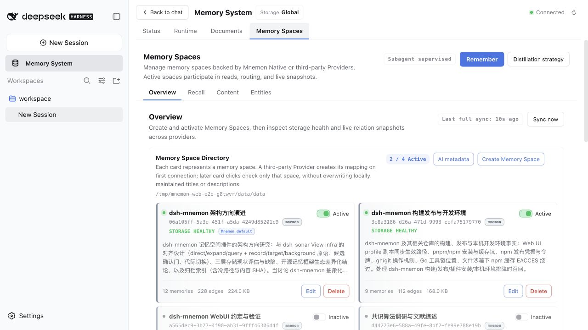

# v0.5.4 Light WebUI / v0.5.4 浅色界面

Captured on **2026-09-07 (Asia/Shanghai)** from the real local DSH WebUI, with **Light** selected explicitly in both languages. The supplied Mnemon Pack was imported before every screenshot and recording in this directory. [English guide](../../en/guides/ui-guide.md) · [中文指南](../../zh-CN/guides/ui-guide.md) · [Media index](../README.md).

本组素材于 **2026-09-07（Asia/Shanghai）**从真实本地 DSH WebUI 采集，中英文均明确选择**浅色模式**，全部在导入提供的 Mnemon Pack 后拍摄。此前未提交的深色草稿已从本次素材中移除。

## Environment and data / 环境与数据

| Item / 项目 | Capture environment / 采集环境 |
|---|---|
| Product source / 产品源码 | Released v0.5.4, `6902155e0f3877dca5c5d70468f2a2a1784c7b29` |
| Starter and official plugins / 主包与官方插件 | 0.5.4, built locally and linked through `node scripts/serve-e2e.mjs` |
| Host / 宿主 | Published DSH 0.1.2-rc.1; no Host source modifications / 正式 DSH 包，未修改宿主源码 |
| Runtime / 运行环境 | macOS, Node.js 25.1.0, pnpm 10.13.1, existing Mnemon CLI 0.2.7 |
| Browser / 浏览器 | Codex in-app browser, controlled through the real UI / Codex 内置浏览器，真实 UI 操作 |
| Appearance / 外观 | Light in both locales / 中英文均为浅色 |
| Desktop / 桌面 | 1280 × 720; 26 screenshots per locale / 每种语言 26 张 |
| Narrow / 窄屏 | 390 × 844; four screenshots per locale / 每种语言四张 |
| Runtime data / 运行时数据 | 20 entries: two User Profile, 18 Working Memory / 20 条：用户画像 2 条、工作记忆 18 条 |
| Documents / 档案 | 12 total: 11 active, one archived / 共 12 份：11 份活跃、1 份归档 |
| Memory Spaces / 记忆空间 | Four native spaces, two active; 27 stored memories, 21 in active spaces / 四个原生空间，两个激活；共 27 条记忆，激活空间包含 21 条 |
| Models / 模型 | Loopback fixture endpoint; zero model requests / 回环夹具端点，模型请求为零 |

The pack is format 1, full backup, with 23 ZIP entries and 21 payload files. All payload hashes were checked before the UI safe import. Its SHA-256 is `acc854f386931f928c2feeee41e8df98f8fcc44b5616aabbd3a1a79efc87c31f`. The manifest's historical plugin version is 0.1.0; that is source-backup metadata, not the running UI version. The original ZIP, personal memory directories and raw databases are not part of this PR.

备份为 format 1 完整包，共 23 个 ZIP 条目、21 个有效载荷文件；导入前逐项核验哈希，通过真实页面执行安全合并。上述 SHA-256 标识原始 ZIP。备份 manifest 中的 0.1.0 是历史来源元数据，不是本次运行界面版本；原始 ZIP、个人记忆目录和数据库不进入 PR。

Only the disposable copy's catalog description for `dsh-mnemon 架构方向演进` was edited through the real form, replacing its old product noun with `记忆空间`. IDs, record bodies and historical dates remain unchanged. The imported records stay Chinese when the interface switches to English. Screenshots select public project/community references and generic collaboration preferences; no credentials or raw logs are included. The UI still shows its real temporary storage paths and the public repository's local source path.

仅在临时副本中，通过真实编辑表单将 `dsh-mnemon 架构方向演进` 的目录说明更新为“记忆空间”用语。ID、记录正文与历史日期未改；切换英文界面时，导入记录仍保留中文。画面选取公开项目、社区资料与通用协作偏好，不包含凭据或原始日志；界面中的临时存储路径与公开仓库的本地源码路径保留真实显示。

## Recordings / 录制

[English Light demo — 41.88 s](./en/demo.mp4) · [中文浅色演示 — 42.13 秒](./zh-CN/demo.mp4)

Both demos continuously sample the actual browser during one uninterrupted interaction sequence, targeting four source frames per second (166 English frames, 167 Chinese frames). Actual frame timestamps determine playback timing. H.264 MP4 encodes at 24 fps, full-range 4:2:0, with fast-start metadata and no audio; repeated output frames do not imply 24 distinct captures per second. There are no cuts, fabricated answers, composited UI or replaced labels. The manifest records exact durations and chapter times.

两段演示分别连续采集一次完整浏览器操作，目标每秒四个源画面，英文 166 帧、中文 167 帧，按真实时间戳控制播放时序。输出为 24 fps 的 H.264 MP4、全范围 4:2:0、快速起播、无音轨；编码重复帧不代表每秒采集了 24 个不同画面。没有剪切、构造回答、拼接界面或替换标签；精确时长与章节时间见 manifest。

| Approximate time / 约计时间 | Visible workflow / 可见流程 |
|---|---|
| 0:00 | Four imported Memory Spaces / 四个导入的记忆空间 |
| 0:04 | Create a Memory Space draft, then cancel / 填写创建草稿后取消 |
| 0:09 | Remember draft, then cancel / 填写沉淀草稿后取消 |
| 0:13 | Keyword recall of imported evidence / 关键词检索导入证据 |
| 0:17 | Native APPSO entity connections / 原生 APPSO 实体关联 |
| 0:22 | Live relationship graph / 实时关系图谱 |
| 0:26 | Imported totals on Status / 状态页导入数据汇总 |
| 0:30 | Detected CLI installation and npm guidance / CLI 当前安装状态与 npm 引导 |
| 0:34 | Expand 16 subpackage versions / 展开 16 个子包版本 |
| 0:39 | Runtime User Profile / 运行时用户画像 |

## Screenshot gallery / 截图图集

Screenshots preserve the browser's original JPEG bytes. All 60 files use Light appearance. / 截图保留浏览器原始 JPEG 数据，60 张均为浅色。

| Surface / 场景 | English | 简体中文 |
|---|---|---|
| Status / 状态 | [Open](./en/status.jpg) | [查看](./zh-CN/status.jpg) |
| npm version guidance / npm 版本引导 | [Open](./en/versions.jpg) | [查看](./zh-CN/versions.jpg) |
| Expanded subpackages / 展开子包 | [Open](./en/versions-expanded.jpg) | [查看](./zh-CN/versions-expanded.jpg) |
| Runtime / 运行时 | [Open](./en/runtime.jpg) | [查看](./zh-CN/runtime.jpg) |
| Configured Runtime budgets / 运行时容量配置 | [Open](./en/runtime-configured.jpg) | [查看](./zh-CN/runtime-configured.jpg) |
| Runtime creation draft / 新增运行时记忆草稿 | [Open](./en/runtime-create.jpg) | [查看](./zh-CN/runtime-create.jpg) |
| Document directory / 档案目录 | [Open](./en/documents.jpg) | [查看](./zh-CN/documents.jpg) |
| Document reader / 档案阅读器 | [Open](./en/document-reader.jpg) | [查看](./zh-CN/document-reader.jpg) |
| Document creation draft / 新建档案草稿 | [Open](./en/document-create.jpg) | [查看](./zh-CN/document-create.jpg) |
| Documents disabled / 档案停用状态 | [Open](./en/documents-disabled.jpg) | [查看](./zh-CN/documents-disabled.jpg) |
| Memory Space directory / 记忆空间目录 | [Open](./en/spaces.jpg) | [查看](./zh-CN/spaces.jpg) |
| Create Memory Space draft / 创建记忆空间草稿 | [Open](./en/space-create.jpg) | [查看](./zh-CN/space-create.jpg) |
| Edit Memory Space / 编辑记忆空间 | [Open](./en/space-edit.jpg) | [查看](./zh-CN/space-edit.jpg) |
| Metadata selection / 元信息选择 | [Open](./en/metadata.jpg) | [查看](./zh-CN/metadata.jpg) |
| Distillation strategy / 沉淀策略 | [Open](./en/strategy.jpg) | [查看](./zh-CN/strategy.jpg) |
| Remember draft / 沉淀记忆草稿 | [Open](./en/remember.jpg) | [查看](./zh-CN/remember.jpg) |
| Direct keyword recall / 直接关键词检索 | [Open](./en/recall.jpg) | [查看](./zh-CN/recall.jpg) |
| Filtered content / 内容筛选 | [Open](./en/content.jpg) | [查看](./zh-CN/content.jpg) |
| Entity connections / 实体关联 | [Open](./en/entities.jpg) | [查看](./zh-CN/entities.jpg) |
| Live graph / 实时图谱 | [Open](./en/graph.jpg) | [查看](./zh-CN/graph.jpg) |
| General settings / 通用设置 | [Open](./en/settings.jpg) | [查看](./zh-CN/settings.jpg) |
| Memory Source switches / 记忆层开关 | [Open](./en/settings-layers.jpg) | [查看](./zh-CN/settings-layers.jpg) |
| Optional enhancements / 可选记忆增强 | [Open](./en/enhancements.jpg) | [查看](./zh-CN/enhancements.jpg) |
| Native embedding settings / 原生嵌入设置 | [Open](./en/native-settings.jpg) | [查看](./zh-CN/native-settings.jpg) |
| Backup controls / 备份操作 | [Open](./en/backup.jpg) | [查看](./zh-CN/backup.jpg) |
| ZIP import preview / ZIP 导入预览 | [Open](./en/backup-preview.jpg) | [查看](./zh-CN/backup-preview.jpg) |
| Narrow navigation / 窄屏导航 | [Open](./en/spaces-mobile.jpg) | [查看](./zh-CN/spaces-mobile.jpg) |
| Narrow directory cards / 窄屏目录卡片 | [Open](./en/space-directory-mobile.jpg) | [查看](./zh-CN/space-directory-mobile.jpg) |
| Narrow creation sheet / 窄屏创建表单 | [Open](./en/space-create-mobile.jpg) | [查看](./zh-CN/space-create-mobile.jpg) |
| Narrow version maintenance / 窄屏版本维护 | [Open](./en/versions-mobile.jpg) | [查看](./zh-CN/versions-mobile.jpg) |

## Reproduce and interpret / 复现与判读

1. Build v0.5.4 and its official plugins, then run `pnpm e2e:serve` with a disposable Profile and storage root. Follow the [development guide](../../en/development/README.md); never substitute a personal memory directory.
2. In Settings → Memory System → Mnemon Native → Backup and migration, select a suitable Mnemon Pack, inspect the preview and perform safe import. Confirm totals on Status before recording. This source pack is not distributed; use your own publishable sample data to reproduce the workflow.
3. Set Light explicitly. Switch the actual DSH language setting for matching English and Chinese coverage. Runtime captures select User Profile; Content and Recall use `后台自我进化`, Recall uses Keyword search, Entities uses `APPSO`, and Documents uses `生态目录` with the matching community-index document selected.
4. Capture at 1280 × 720 and inspect the key narrow surfaces at 390 × 844. Cancel all creation, Remember and metadata drafts. Temporarily disable Documents and change Runtime limits only for their named state captures; re-enable Documents and restore default limits afterward.
5. Capture a continuous browser sequence for each demo and encode the timestamps once. Inspect every screenshot and representative decoded video frames; check all source frames for legacy product labels. Stop the fixture to dispose the imported copy after validation.

中文复现：构建 v0.5.4 并启动临时 `pnpm e2e:serve` 环境；在 Native 备份区预览并安全导入适合公开展示的数据，先核对状态汇总；明确设置浅色，使用 DSH 真实语言设置切换中英文；按上述筛选采集桌面与窄屏界面。所有创建、沉淀与元信息草稿均取消，临时关闭的档案与提高的 Runtime 容量在采集后恢复。连续采集两种语言的实际操作，核对画面后停止夹具并清理导入副本。来源备份不随仓库分发，复现时需自行准备可公开的样例。

The [manifest](./manifest.json) records all 62 media files, dimensions, timestamps, theme, hashes and video chapters. OCR checked all 60 screenshots and all 333 source video frames, with zero legacy-label matches or recognition errors; manual inspection checked their visible context. Both MP4 files decoded without errors, and the active browser reported no warnings or errors after capture. OCR is a supporting check, not proof that every possible application state was tested.

[清单](./manifest.json)记录全部 62 份媒体的尺寸、时间戳、主题、哈希及视频章节。60 张截图与 333 个视频源画面均完成 OCR，旧标签匹配与识别错误为零，并人工检查可见内容。两段 MP4 均可无错解码，采集后浏览器无 warning/error。OCR 只作为辅助检查，不代表覆盖所有应用状态。

The npm panel shows the real Homebrew CLI 0.2.7 installation, npm's checked 0.2.8 release, and source-linked dsh-mnemon 0.5.4. No install or update was executed. Agent Query, semantic writes, AI metadata generation, embeddings and cloud Providers were not evaluated. The graph displays 47 elements and 301 connections from two active spaces; its 24 projected graph entities and the Entities page's 39 indexed entities have different scopes.

npm 面板真实展示 Homebrew CLI 0.2.7、查询到的 npm 0.2.8，以及源码链接的 dsh-mnemon 0.5.4，未执行安装或更新。未评估 Agent 查询、语义写入、AI 元信息生成、嵌入或云 Provider。图谱展示两个激活空间的 47 个元素与 301 条连接；图谱投影中的 24 个实体与实体页的 39 个索引实体统计范围不同。

At 390px, long card names and some metrics truncate. The Chinese disabled Documents surface still exposes the Source title `Project Documents`. These are observed v0.5.4 limits, not edited away. This capture does not claim all Host settings or physical phones pass; the [historical settings limitation](../../en/reference/compatibility.md) remains explicitly scoped.

390px 下长卡片名称与部分指标会截断；中文档案停用页仍显示 Source 标题 `Project Documents`。这些是 v0.5.4 的实际限制，未修饰画面。本次不声称所有 Host 设置页或真实手机均通过，[历史设置限制](../../zh-CN/reference/compatibility.md)继续保留明确边界。
