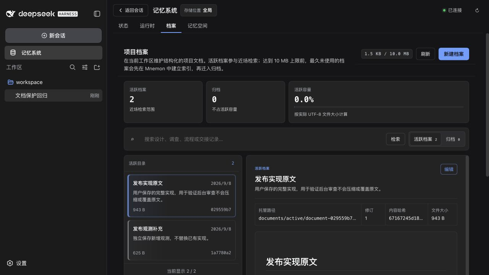
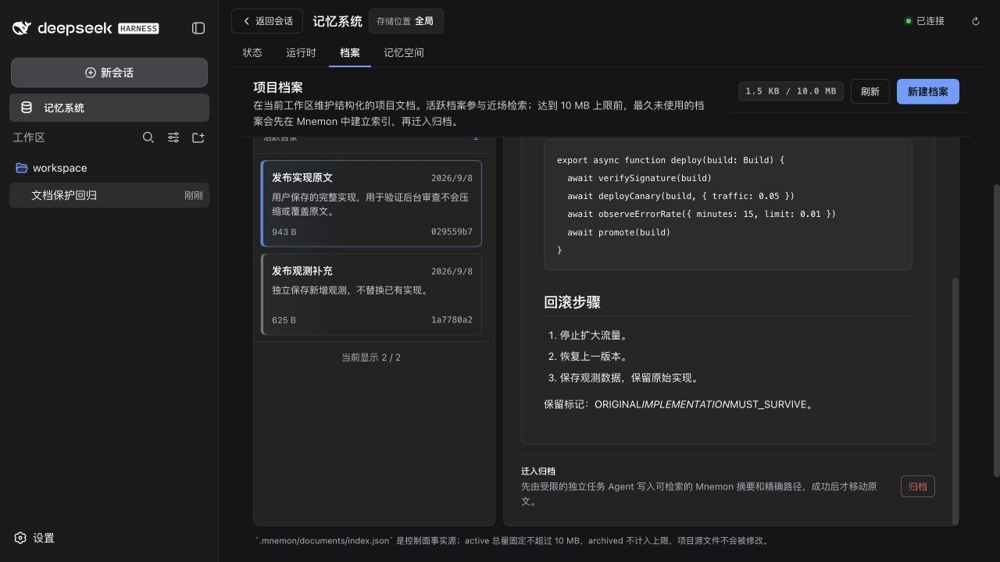
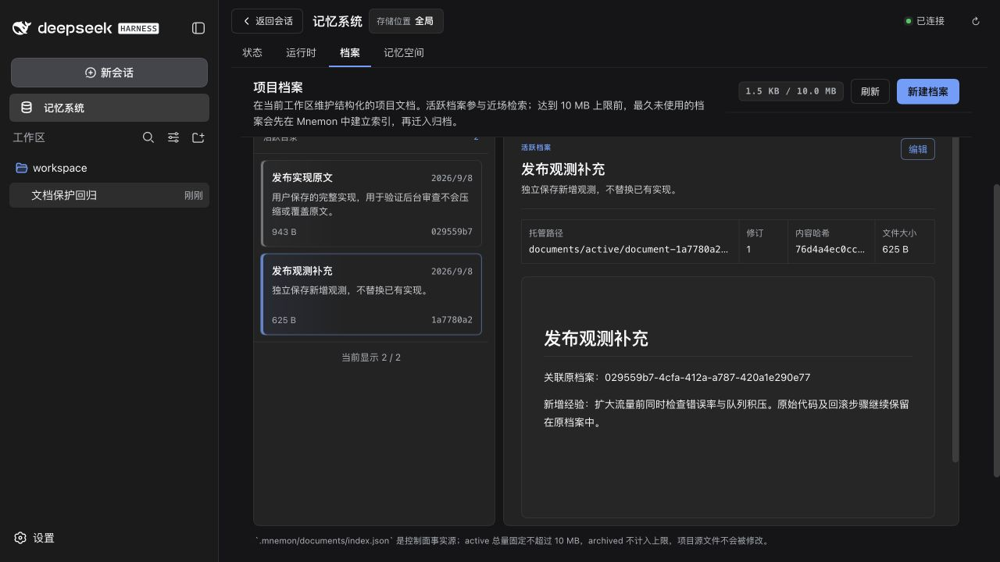
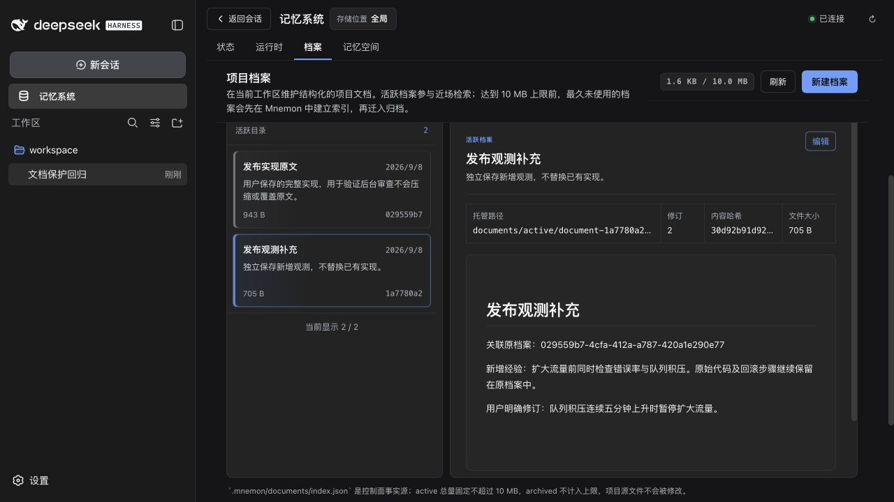

# PR #199 document protection evidence / 档案保护验证

Verified locally on 2026-09-08 (Asia/Shanghai), with implementation commit `f8f619a2fb77d27204b08ead027cee48440065a1` on top of original PR head `5919b95`. Only `dsh-mnemon` and `dsh-mnemon-source-documents` change published behavior. The original contributor's two commits are retained.

2026-09-08（Asia/Shanghai）对原 PR 提交 `5919b95` 上追加的实现提交 `f8f619a2fb77d27204b08ead027cee48440065a1` 完成本地验证。发布行为变更仅涉及 `dsh-mnemon` 和 `dsh-mnemon-source-documents`，原贡献者的两条提交保留。

## Validation / 验证

| Check / 检查 | Result / 结果 |
| --- | --- |
| Node 22.19.0, pnpm 10.13.1: `pnpm run verify` | Passed: 1,114 tests, including 806 root tests and 38 Documents Source tests. Two existing opt-in Native tests skipped. / 通过：1,114 项测试，含根包 806 项、Documents Source 38 项；两项现有 Native 可选测试跳过。 |
| Deterministic build, Headless, package checks / 确定性构建、Headless、包检查 | Passed; 39 deterministic build files, 39 Headless tools, 8 representative Mnemon tools. / 全部通过。 |
| Node 24.20.0, pnpm 10.13.1: `MNEMON_PLUGIN_VERIFY_CONCURRENCY=4 pnpm run verify:plugins` | Passed: 17 packed artifacts and 16 independently installed plugin repositories, external consumer, real DSH Starter and optional Strategy activation. / 17 个制品、16 个插件独立安装、外部消费者和真实 DSH 加载全部通过。 |
| Before-fix targeted tests / 修复前定向回归 | 14 failed, 64 passed: missing create-only capability, explicit-forget persona conflict and false success reporting. / 14 项失败、64 项通过，复现缺失的仅创建能力、显式删除 persona 冲突和误报成功。 |
| Real WebUI / 真实界面 | Forbidden overwrite rejected, separate supplement created, original bytes and metadata unchanged, explicit edit succeeds; no browser console errors. / 覆盖被拒绝，补充独立创建，原文及元数据不变，显式编辑成功，浏览器无控制台错误。 |

The skipped tests are `source-memory-spaces/tests/native-integration.spec.ts` and `windows-smoke.spec.ts`; they require their opt-in Native environment. A published upstream UI package emits an existing missing-source-map warning during build; the checks pass.

跳过项为 `source-memory-spaces/tests/native-integration.spec.ts` 和 `windows-smoke.spec.ts`，需要额外启用的 Native 环境。构建存在已发布上游 UI 包缺少 source map 的现有警告，不影响验证通过。

Focused regressions cover autonomous forget exclusion, explicit forget availability and receipts, create payload injection, identical titles, capacity rejection without archiving, read-only/disabled/manual-only Sources, preserved management updates, and writeback navigation. See `tests/document-protection.spec.ts`, `tests/subagent.spec.ts`, `tests/commands.spec.ts`, and `plugins/dsh-mnemon-source-documents/tests/create-action.spec.ts`.

定向回归覆盖自主删除权限、显式删除入口与回执、创建参数注入、同名档案、满容量拒绝且不归档、只读/关闭/仅手动 Source、正常管理更新和写回导航。对应测试文件见上。

## Reproduction / 复现

```sh
pnpm install --frozen-lockfile
pnpm build
pnpm --workspace-concurrency=4 -r build
pnpm e2e:serve --document-protection
```

1. Open the loopback WebUI URL printed by the fixture, select its printed temporary workspace and the **Mnemon E2E** preset. / 打开夹具打印的本机地址，选择对应临时工作区和 **Mnemon E2E** 预设。
2. Send a substantial request to save a release implementation, then a second request to remember queue-backlog monitoring as a separate supplement. Use at least 320 total user characters and two turns to exercise the real idle-review admission and activity gates. / 先请求保存发布实现，再请求将队列积压观测作为独立补充记住；两轮用户文本合计至少 320 字，以通过真实的空闲审查准入和活动门槛。
3. Wait for the fixture's five-second idle window. The scripted model deliberately calls the unavailable `mnemon_document_manage` update tool; the fixture asserts DSH returns `unknown tool`, then creates one independent supplement through `mnemon_document_create`. / 等待夹具的五秒空闲窗口；脚本模型故意调用不可用的管理工具覆盖原文，断言 DSH 拒绝后，通过仅创建工具保存独立补充。
4. Open **Memory system → Documents**. Inspect the original revision, hash, code and rollback steps, and the supplement's reference to the original ID. Compare the original file bytes and index metadata captured before the second turn with those after review. / 打开**记忆系统 → 档案**，核对原文版本、哈希、代码、回滚步骤以及补充对原 ID 的引用；对比第二轮前后保存的原文件字节和索引元数据。
5. Edit the supplement through the UI and save a revision. Its revision becomes 2; the original stays byte-identical at revision 1. / 在界面明确编辑补充并保存，第 2 版成功产生，原文仍逐字节一致且为第 1 版。
6. Stop the fixture with Ctrl-C after saving evidence; it removes its disposable state. / 保存证据后用 Ctrl-C 停止，夹具会清理一次性数据。

The fixture scripts only model replies. DSH `0.1.2-rc.1`, tool filtering, review scheduling, Source mutation, persistence and WebUI are real published components running against these changes. This validates transport, authorization and data preservation, not a production model's memory-selection quality. All text and IDs in the evidence belong to synthetic disposable data; no remote Provider, production memory or real credentials were used.

夹具仅脚本化模型回复；DSH `0.1.2-rc.1`、工具过滤、审查调度、Source 写入、持久化和 WebUI 均为加载本次改动的真实已发布组件。本次验证证明调用链、权限和数据保留行为，不代表生产模型的记忆筛选质量。证据中的正文和 ID 均来自合成的一次性数据，未使用远程 Provider、生产记忆或真实凭据。

## Persisted assertions / 持久化断言

[assertions.json](./assertions.json) records the actual dispatcher rejection and disk comparisons. The original remains active at revision 1 with content hash `67167245d1896658a49a0544ca75a51cd94480276419a817b1ddbd6b256624fc`. There are two active documents and zero archived documents. The separately created supplement advances from revision 1 to 2 only after the explicit UI edit.

[assertions.json](./assertions.json) 记录真实调度器拒绝和磁盘对比结果。原文始终活跃、修订为 1、内容哈希如上。两份档案均活跃，归档数为零；补充仅在明确的界面编辑后由第 1 版变为第 2 版。

## Screenshots / 截图

Original revision and independent document list after review / 审查后原文版本和独立档案列表：



Original implementation, rollback steps and preservation marker / 保留的原实现、回滚步骤和标记：



Independent supplement references the original / 独立补充引用原档案：



Explicit UI edit succeeds with revision 2 / 界面明确编辑成功，修订为 2：


